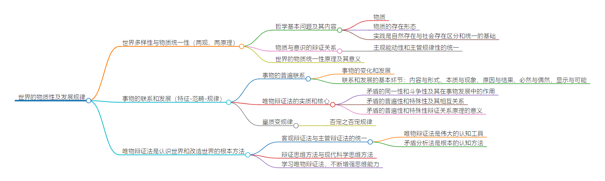
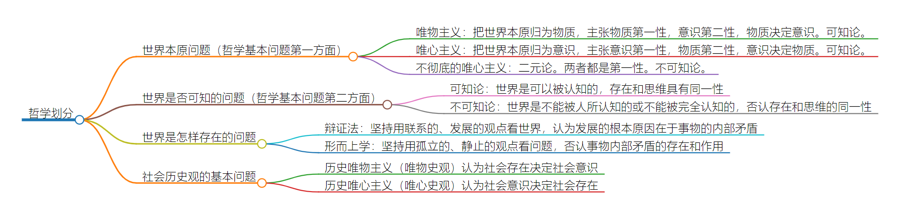

# 第一章 世界的物质性及发展规律

> **内容提要** **本章阐述了马克思主义唯物论和辩证法的基本原理**

**第一节重点阐述马克思主义的“两观”、“两理论”**，即物质观、意识观；物质与意识的辩证关系原理、世界物质统一性原理。

**第二节重点阐述唯物辩证法的理论，概括为两个总特征**——联系和发展的观点是唯物主义辩证法的总观点和总特征；**三个规律**——对立统一规律、量变质变规律和否定之否定规律；**五对基本范畴**——内容与形式、本质与现象、原因与结果、必然与偶然、显示与可能。**其逻辑顺序是：特征-范畴-规律**。

**第三节重点阐述唯物辩证法是认识世界和改造世界的根本方法**，内容包括：客观辩证法与主观辩证法的统一；唯物辩证法是伟大的认识工具；矛盾分析方法是根本的认识方法；辩证思维方法与现代科学思维方法；增强辩证思维能力。

> **重点** **选择题知识要点**：哲学基本问题；物质范畴；社会的物质性；物质运动与时空；时空的特征；社会生活本质上是实践的；规律及其客观性；意识的本质和作用；辩证否定管；质、量、度；唯物辩证法的总特征。**分析题要点**：物质与意识的辨证关系；矛盾的两种属性及其在事物发展中的作用；矛盾问题的精髓（矛盾的普遍性与特殊性）；矛盾分析方法；辩证法基本范畴。**重中之重：辩证法原理**

> [Mind_Map_C1](asserts/Mind_Map_C1.html)

## 第一节 世界多样性与物质统一性

### 一、物质及其存在形态

世界观是人们对整个世界的总体看法和根本观点

#### （二）哲学基本问题及其内容

> 1. **哲学基本问题——存在和思维的关系问题**。恩格斯首先指出。
> 2. 哲学的基本问题包括两个方面：存在和思维谁是世界的本原，即物质和意识何者为第一性（唯物/唯心）；思维能否能正确认知存在的问题，即思维和存在有无同一性（可知/不可知）。
> 3. 哲学基本问题原理的意义。马克斯主义关于哲学基本问题的原理为研究哲学发展历史和显示提供了一条基本的指导线索，为划分哲学基本派别确定了科学标准。
> 4. **唯物主义和唯心主义、可知论和不可知论、辩证法和形而上学（*）**

[Mind_Map_Philosophy](asserts/Mind_Map_Philosophy.html)

> 5. **唯物主义与辩证法要统一起来。**只由既坚持唯物主义，又坚持辩证法，才能全面地认识世界的本质和发展规律。只有达到唯物主义和辩证法的内在统一，才能有科学的彻底的唯物主义和科学的彻底的辩证法。
> 6. **扩展**

主观唯心：把人的感觉、观念当作世界的本原。（关键词：心、观念、感觉等）
客观唯心：把脱离物质、任何个人的精神作为世界的本原。（关键词：理、理念、绝对观念等）

#### （二）物质

> 1. **物质和物质范畴（*）**

>> (1) **唯物主义对物质的认识过程。**物质范畴是唯物主义关于世界本原和统一性的最高抽象，是唯物主义世界观的即使。对“物质”的认知的深度和广度是区分唯物主义三种形态的重要依据
<table style="border-collapse:collapse;border-spacing:0" class="tg"><thead><tr><th style="border-color:inherit;border-style:solid;border-width:1px;font-family:Arial, sans-serif;font-size:14px;font-weight:normal;overflow:hidden;padding:10px 5px;text-align:center;vertical-align:top;word-break:normal" colspan="3">三种形态的唯物主义对物质的理解</th></tr></thead><tbody><tr><td style="border-color:inherit;border-style:solid;border-width:1px;font-family:Arial, sans-serif;font-size:14px;overflow:hidden;padding:10px 5px;text-align:center;vertical-align:top;word-break:normal">唯物主义的三种形态</td><td style="border-color:inherit;border-style:solid;border-width:1px;font-family:Arial, sans-serif;font-size:14px;overflow:hidden;padding:10px 5px;text-align:center;vertical-align:top;word-break:normal">对物质的理解</td><td style="border-color:inherit;border-style:solid;border-width:1px;font-family:Arial, sans-serif;font-size:14px;overflow:hidden;padding:10px 5px;text-align:center;vertical-align:top;word-break:normal">共同点</td></tr><tr><td style="border-color:inherit;border-style:solid;border-width:1px;font-family:Arial, sans-serif;font-size:14px;overflow:hidden;padding:10px 5px;text-align:center;vertical-align:top;word-break:normal">古代朴素唯物主义</td><td style="border-color:inherit;border-style:solid;border-width:1px;font-family:Arial, sans-serif;font-size:14px;overflow:hidden;padding:10px 5px;text-align:center;vertical-align:top;word-break:normal">金木水火土等具体物质形态</td><td style="border-color:inherit;border-style:solid;border-width:1px;font-family:Arial, sans-serif;font-size:14px;overflow:hidden;padding:10px 5px;text-align:center;vertical-align:top;word-break:normal" rowspan="3"> 从朴素到科学、从片面到比较全面， 但都把世界的本原归为物质， 主张物质第一性，意识第二性</td></tr><tr><td style="border-color:inherit;border-style:solid;border-width:1px;font-family:Arial, sans-serif;font-size:14px;overflow:hidden;padding:10px 5px;text-align:center;vertical-align:top;word-break:normal">近代形而上学唯物主义</td><td style="border-color:inherit;border-style:solid;border-width:1px;font-family:Arial, sans-serif;font-size:14px;overflow:hidden;padding:10px 5px;text-align:center;vertical-align:top;word-break:normal">原子</td></tr><tr><td style="border-color:inherit;border-style:solid;border-width:1px;font-family:Arial, sans-serif;font-size:14px;overflow:hidden;padding:10px 5px;text-align:center;vertical-align:top;word-break:normal">现代辩证唯物主义</td><td style="border-color:inherit;border-style:solid;border-width:1px;font-family:Arial, sans-serif;font-size:14px;overflow:hidden;padding:10px 5px;text-align:center;vertical-align:top;word-break:normal">客观实在</td></tr></tbody></table>

>> (2) **马克思主义物质观。**马克思皮牌了旧唯物主义对物质世界的直观、消极的理解，**强调要从能动的实践出发去把握客观世界的意义**。
**恩格斯对物质概念做了初步概括**，指出了哲学物质概念与自然科学该奶奶关于具体物质形态和物质结构的概念之间的**共性与个性的关系**。
**列宁对物质概念做了全面的科学的规定**：“物质是标志客观实在的哲学范畴，这种客观实在是人通过感觉感知的，**它不依赖于我们的感觉而存在**，为我们的感觉所复写、摄影、反映。”**列宁是从物质和意识的关系上来把握物质的。物质的唯一特性是客观实在性，它存在于人的意识之外，可以为人的意识所反映。所谓物质，就是不依赖于人的意识而存在，并能为人类的意识所反映的客观存在**。

客观实在不一定要看得见、摸得着——重点在于存在于人的意识之外，不以人的意志而转移。（磁场、生产关系、生产力是客观存在）
自然科学物质结构概念与哲学物质范畴是个别与一般、个性与共性的关系。

##### 马克思主义物质观的理论意义（*）

> **第一，坚持了唯物主义一元论，同唯心主义一元论和二元论划清了界限**。**根本特点**：从与意识的对立同一关系中去把握物质、规定物质。列宁的规定指明，**物质对于意识的独立性、根源性，意识对于物质的依赖性、派生性**。

> **第二，坚持了能动的反映论和可知论，有力的批判了不可知论**。物质这一客观存在是可以认知的对象。世界上hi存在尚未认知的东西，不存在不可认知的东西。

> **第三，体现了唯物论和辩证法的统一，克服了形而上学唯物主义的缺陷**。客观实在性是物质的共性、唯一特性。个性中看到共性，相对中找到绝对，暂时中发现永恒，这是马克思主义物质观体现的唯物辩证法。
> **第四，体现了唯物主义自然观和唯物主义历史观的统一，为彻底的唯物主义奠定了理论基础**。

物质和意识的对立，只有在谁为第一性这个问题范围内才有绝对意义。
马克思以前旧唯物主义在自然观唯物，历史观唯心。马克思实现了唯物主义自然观和历史观的统一。

#### 物质的存在形态（*）
##### 物质与运动
> **运动是物质的根本属性**。世界是物质的，而物质是运动的。运动是标志一切事物和现代的变化及其过程的哲学范畴。
> **物质和运动不可分割**。物质是运动着的物质，脱离运动的物质不存在，设想无运动的物质将导致形而上学；运动是物质的运动，物质是一切运动变化和发展的实在基础和承担者（载体），没有脱离物质的鱼洞，设想无物质的运动将导致唯心主义。

##### 运动与静止
> **静止的含义**。一切物质都是运动的。运动是普遍的、永恒的、无条件的，是绝对的（“人不能两次踏进同一条河流”）。但是物质运动中由包含着暂时的、有条件的、相对的静止。**静止是运动的特殊状态，是物质运动在一定条件下的稳定状态，包括空间的相对位置暂时不变和事物的根本性质暂时不变这样两种运动的特殊状态**。
> **绝对运动和相对静止的辩证统一**。运动的绝对性——变动性、无条件性；静止的相对性——稳定性、有条件性。运动静止相互依赖、相互渗透、相互包含。”动中有静、静中有动“。无条件的绝对运动和有条件的相对静止构成了事物的矛盾运动。
> 相对静止是事物存在和发展的**必要条件**；是人们认识和利用事物的**前提**；是过去运动的结果和未来运动的**出发点**；是理解和衡量运动的**尺度**。
> 否认绝对运动，绝对化相对静止，会走向形而上学不变论；借口绝对运动，否认相对静止，会导致相对主义的诡辩论（如“人连一次都不能踏进同一条河流”）。

